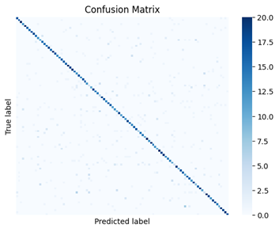

# Custom-ResNet-Reimplementation
The following is a reimplementation of ResNet128 in Tensorflow as per the ResNet paper https://arxiv.org/abs/1512.03385. 128 refers to the number of layers.
This reimplementation is realized in the context of a classification task involving 100 classes.

## Loading Data

For data loading, image_dataset_from_directiory was used. Since the data was already separated into train and validation folders, no further split took place.
The dataset is formed of 64x64 RGB images generated using a diffusion model belonging to 100 different classes. Each class has 200 samples for training.

## Data Preprocessing

* All images were normalized using per_image_standardization from the tensorflow library.
* Data Augmentation: Horizontal and Vertical random flips were used to increase the generalization of the model during training

## Model Training

Three callbacks were used to prevent overfitting:

* Model checkpoint to monitor the validation accuracy, saving the best model in "weights only" format
* Early stopping with patience 8
* Reduce Learning rate on plateau with patience 5 by a factor of 0.5 monitoring validation accuracy

The optimizer used was AdamW, an Adam variant applying weight decay directly to the parameters during training.

The model was trained for 50 epochs, with a batch size of 64.

## Accuracy and Loss

  
  

* Validation accuracy and loss converge around 20 epochs and stay constitent until the end of training
* Validation accuracy was 0.734
* Test accuracy was 0.737. From this we can infer that the model generalizes well

## Results

Confusion matrix for validation set:

  

  <!--  -->
